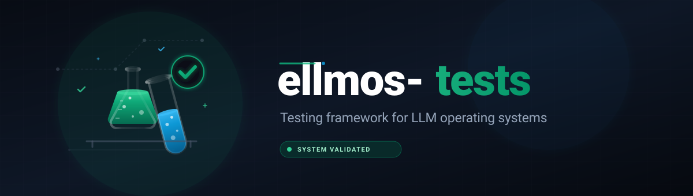

# ellmos-tests

> Structured B/O/E testing framework for LLM operating systems

[](https://python.org)
[](LICENSE)
[](system_diff_tests/)
[](tests/)
[](https://github.com/ellmos-ai/ellmos-tests/actions/workflows/tests.yml)

**Quick links:** [Test Philosophy](#test-philosophy-b--o--e) · [Quick Start](#quick-start) · [Features](#features) · [Contributing](CONTRIBUTING.md)

---

## What is this?

**ellmos-tests** evaluates and compares SKILL.md-based systems (LLM operating systems) through three complementary test perspectives. It provides a structured methodology to assess how well an LLM-OS performs across onboarding, navigation, memory, task management, tools, communication, and error tolerance.

It is also packaged as an LLM-bindable ellmos module: `SKILL.md` tells an agent how to operate the testkit, and `ellmos-module.v2.json` (canonical manifest) declares category, capabilities, surfaces, and boundaries. The older `ellmos-module.json` (v1 schema) is deprecated and only kept for readers that still discover modules by that filename.

---

## Test Philosophy: B / O / E

| Perspective | Type | Question | Tests |
|-------------|------|----------|-------|
| **B-Tests** (Observation) | Automated, external | *"What exists?"* | 8 tests (B001–B008) |
| **O-Tests** (Output) | Functional, input→output | *"Does it work?"* | 6 tests (O001–O006) |
| **E-Tests** (Experience) | Subjective, process-oriented | *"How does it feel?"* | 10 tasks (E001–E010) |

**Definitions vs. automated suite.** The 24 B/O/E entries above are *test definitions* that this kit runs
against a target system — and the 10 E-tasks among them are prompts for a human or an LLM, not code.
They are not the test suite of this repository. The repository's own regression suite is the 14 unittest
tests under `tests/` (`python -m unittest discover -s tests`), which cover the battery parser, the
config path resolution, the module surfaces, and the public-readiness gates.

| B-Tests — OBSERVATION | O-Tests — OUTPUT | E-Tests — EXPERIENCE |
|-----------------------|------------------|----------------------|
| Inventory | Validation | Workflow |
| Structure | Correctness | Orientation |
| Consistency | Completeness | Cognitive Load |
| Metrics | Robustness | Agency |

---

## Features

- **8 B-Tests** — File inventory, format consistency, directory depth, naming analysis, documentation check, code metrics, dependency scan, age analysis
- **6 O-Tests** — Task roundtrip, memory persistence, tool registry, backup/restore, config validation, export/import
- **10 E-Tests** — SKILL.md readability, navigation, task creation, task finding, memory write/read, tool usage, error recovery, session start, overall impression
- **Feature Mapping DB** — SQLite database with 50+ features, multi-dimensional ratings, alias resolution, gap analysis, and duplicate detection
- **Synopsis Generator** — Automated cross-system comparisons with JSON + Markdown output
- **Use-Case Catalog** — `usecases.json`: machine-readable catalog of 50 user-oriented BACH use cases with `covering_skill` and `coverage_status` (COVERED/PARTIAL/OPEN), generated from `bach.db` via `tools/usecases_sync.py`. Separate from the archived system-oriented legacy battery (`usecases_system_legacy.txt`, UC001–UC049).
- **Test Batteries** — Predefined test collections (smoke tests, UX tests, integration tests, etc.)
- **System Classification** — SKILL / AGENT / TEXT-OS with class-appropriate test weighting
- **LLM module surface** — `SKILL.md`, `AGENTS.md`, and `ellmos-module.v2.json` for direct agent use
- **Compatibility runners** — BACH-style wrappers under `system_diff_tests/testing/`
- **Optional Playwright helpers** — portable browser smoke-test utilities; Playwright is not required for the core testkit

---

## Quick Start

```bash
# Clone the repository
git clone https://github.com/ellmos-ai/ellmos-tests.git
cd ellmos-tests

# Run B-Tests against a system
python system_diff_tests/run_all.py "/path/to/your/llm-os" --only b

# Run O-Tests against a system
python system_diff_tests/run_all.py "/path/to/your/llm-os" --only o

# Run all automated tests
python system_diff_tests/run_all.py "/path/to/your/llm-os"

# Use a known system name (configured in config.py)
python system_diff_tests/run_all.py --system recludOS

# Run the BACH-extracted compatibility runner
python system_diff_tests/testing/run_external.py "/path/to/your/llm-os" --profile STANDARD

# List available test batteries
python tests/run_batteries.py --list

# Run a specific battery
python tests/run_batteries.py --battery release_smoke --system-path "/path/to/system"

# Run local smoke checks used by CI
python -m unittest discover -s tests -p "test_*.py"
```

---

## Project Structure

```
ellmos-tests/
├── SKILL.md                    # LLM-facing module instructions
├── AGENTS.md                   # Agent entry note
├── ellmos-module.v2.json       # Machine-readable module manifest (canonical)
├── ellmos-module.json          # Legacy v1 manifest (deprecated, kept for older readers)
├── system_diff_tests/
│   ├── config.py                 # Central configuration (paths, known systems)
│   ├── run_all.py                # Main test runner (B + O tests)
│   ├── testing_workflow.md       # Full B/O/E methodology documentation
│   ├── comparation_workflow.md   # Cross-system comparison guide
│   ├── feature_mapping_workflow.md
│   ├── testing/                  # B-Test and O-Test scripts
│   │   ├── run_external.py      # BACH-extracted compatibility runner
│   │   ├── run_b_tests.py       # Wrapper for b_tests/run_b_tests.py
│   │   ├── run_o_tests.py       # Wrapper for o_tests/run_o_tests.py
│   │   ├── b_tests/             # B001–B008 observation tests
│   │   ├── o_tests/             # O001–O006 output tests
│   │   ├── e_tests/             # Manual E-test prompts/tasks
│   │   ├── profiles/            # Current profile names used by BACH help
│   │   ├── t_profiles/          # Legacy profile folder kept for compatibility
│   │   └── playwright/          # Optional browser helper scripts
│   ├── mapping/
│   │   ├── schema.sql           # Feature mapping DB schema
│   │   ├── populate_db.py       # DB population script
│   │   ├── query_db.py          # DB query utilities
│   │   └── Templates/           # Scan and diff templates
│   └── output/                  # Generated test results (gitignored)
├── tests/
│   ├── batteries/               # Test battery definitions (.txt)
│   ├── results/                 # Generated battery runner results (gitignored)
│   ├── interpretations/         # Generated human-readable analysis (gitignored)
│   ├── run_batteries.py         # Battery test runner
│   ├── run_db_tests.py          # Database-specific tests
│   ├── test_config_paths.py
│   ├── test_run_batteries.py
│   └── test_module_surfaces.py
├── testing/                     # Additional test scripts
│   ├── test_api_modus_a.py
│   ├── test_api_modus_b.py
│   └── test_hq6_snapshot.py
└── README.md
```

---

## Test Profiles

| Profile | Duration | Tests | Purpose |
|---------|----------|-------|---------|
| **QUICK** | ~10 min | E001, E002, E010 | First impression |
| **STANDARD** | ~25 min | 9 E-Tests (excl. E008) | Full experience |
| **FULL** | ~40 min | All 10 E-Tests | Thorough analysis |
| **MEMORY_FOCUS** | ~15 min | E005, E006, E010 | Memory comparison |
| **TASK_FOCUS** | ~15 min | E003, E004, E010 | Task comparison |
| **OBSERVATION** | ~20 min | B001–B008 | External analysis (automated) |
| **OUTPUT** | ~30 min | O001–O006 | Functional tests (automated) |

**Recommended order:** OBSERVATION → OUTPUT → QUICK → STANDARD/FULL

---

## 7 Evaluation Dimensions

Each system is rated on a 1–5 scale across these dimensions:

| Dimension | Question |
|-----------|----------|
| **D1 Onboarding** | How quickly can you get started? |
| **D2 Navigation** | How well can you find your way around? |
| **D3 Memory** | How well does persistence work? |
| **D4 Tasks** | How good is task management? |
| **D5 Communication** | How good is user interaction? |
| **D6 Tools** | How usable are the tools? |
| **D7 Error Tolerance** | How robust is error handling/recovery? |

### Score Interpretation

| Score | Meaning |
|-------|---------|
| 1 | Very poor / Not present |
| 2 | Poor / Deficient |
| 3 | Average / Acceptable |
| 4 | Good / Above average |
| 5 | Excellent |

---

## System Classification

Before testing, classify the system under test:

| Class | Definition | Test Focus |
|-------|-----------|------------|
| **SKILL** | Single capability, one SKILL.md file | Readability, completeness, applicability |
| **AGENT/HUB** | Skill collection with central control | Navigation, tools, help system, consistency |
| **TEXT-OS** | Full operating system for LLM sessions | Lifecycle, memory, automation, recovery |

---

## Configuration

System paths are managed centrally via `system_diff_tests/config.py`.

Environment variables:
- `ELLMOS_BASE_PATH` — Root of the ellmos-tests project
- `ELLMOS_ONEDRIVE` — OneDrive base path (default: `~/OneDrive`)
- `NO_COLOR` — Disable colored terminal output
- `FORCE_COLOR` — Force colored terminal output

Optional browser helpers under `system_diff_tests/testing/playwright/` require `requirements-optional.txt` plus installed browser binaries. The core B/O/E testkit remains Python standard-library only.

---

## Contributing

See [CONTRIBUTING.md](CONTRIBUTING.md) for guidelines.

---

## License

[MIT](LICENSE) — Copyright 2026 Lukas Geiger

---

## Deutsch

### Was ist das?

**ellmos-tests** evaluiert und vergleicht SKILL.md-basierte Systeme (LLM-Betriebssysteme) anhand von drei komplementären Testperspektiven. Es bietet eine strukturierte Methodik, um die Leistungsfähigkeit eines LLM-OS in den Bereichen Onboarding, Navigation, Gedächtnis, Aufgabenverwaltung, Werkzeuge, Kommunikation und Fehlertoleranz zu bewerten.

### Testphilosophie: B / O / E

| Perspektive | Typ | Fragestellung | Tests |
|-------------|-----|---------------|-------|
| **B-Tests** (Beobachtung) | Automatisiert, extern | *"Was existiert?"* | 8 Tests (B001–B008) |
| **O-Tests** (Ausgabe) | Funktional, Input→Output | *"Funktioniert es?"* | 6 Tests (O001–O006) |
| **E-Tests** (Erfahrung) | Subjektiv, prozessorientiert | *"Wie fühlt es sich an?"* | 10 Aufgaben (E001–E010) |

**Testdefinitionen vs. automatisierte Suite.** Die 24 B/O/E-Einträge sind *Testdefinitionen*, die dieses Kit
gegen ein Zielsystem ausführt — die 10 E-Aufgaben davon sind Prompts für Mensch oder LLM, kein Code.
Die Regressionssuite des Repos selbst sind die 14 unittest-Tests unter `tests/`
(`python -m unittest discover -s tests`).

### Schnellstart

```bash
# Repository klonen
git clone https://github.com/ellmos-ai/ellmos-tests.git
cd ellmos-tests

# B-Tests gegen ein System ausführen
python system_diff_tests/run_all.py "/pfad/zum/llm-os" --only b

# Alle automatisierten Tests ausführen
python system_diff_tests/run_all.py "/pfad/zum/llm-os"

# Bekanntes System verwenden (konfiguriert in config.py)
python system_diff_tests/run_all.py --system recludOS

# Verfügbare Testbatterien anzeigen
python tests/run_batteries.py --list
```

### 7 Bewertungsdimensionen

| Dimension | Fragestellung |
|-----------|---------------|
| **D1 Onboarding** | Wie schnell kann man starten? |
| **D2 Navigation** | Wie gut findet man sich zurecht? |
| **D3 Gedächtnis** | Wie gut funktioniert Persistenz? |
| **D4 Aufgaben** | Wie gut ist die Aufgabenverwaltung? |
| **D5 Kommunikation** | Wie gut ist die Nutzerinteraktion? |
| **D6 Werkzeuge** | Wie nutzbar sind die Tools? |
| **D7 Fehlertoleranz** | Wie robust ist die Fehlerbehandlung? |

### Systemklassifikation

| Klasse | Definition | Testfokus |
|--------|-----------|-----------|
| **SKILL** | Einzelfähigkeit, eine SKILL.md-Datei | Lesbarkeit, Vollständigkeit, Anwendbarkeit |
| **AGENT/HUB** | Skill-Sammlung mit zentraler Steuerung | Navigation, Tools, Hilfesystem, Konsistenz |
| **TEXT-OS** | Vollständiges Betriebssystem für LLM-Sessions | Lebenszyklus, Gedächtnis, Automatisierung, Recovery |

Detaillierte Battery-Runner-Dokumentation befindet sich in [tests/README.md](tests/README.md).

---

## Haftung / Liability

Dieses Projekt ist eine **unentgeltliche Open-Source-Schenkung** im Sinne der §§ 516 ff. BGB. Die Haftung des Urhebers ist gemäß **§ 521 BGB** auf **Vorsatz und grobe Fahrlässigkeit** beschränkt. Ergänzend gelten die Haftungsausschlüsse aus GPL-3.0 / MIT / Apache-2.0 §§ 15–16 (je nach gewählter Lizenz).

Nutzung auf eigenes Risiko. Keine Wartungszusage, keine Verfügbarkeitsgarantie, keine Gewähr für Fehlerfreiheit oder Eignung für einen bestimmten Zweck.

This project is an unpaid open-source donation. Liability is limited to intent and gross negligence (§ 521 German Civil Code). Use at your own risk. No warranty, no maintenance guarantee, no fitness-for-purpose assumed.

