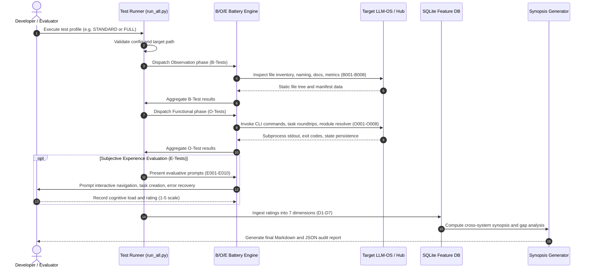

# ellmos-tests

> Structured B/O/E testing framework for LLM operating systems, agent hubs, and SKILL.md architectures

[English](README.md) | [Deutsch](README_de.md)

[](https://python.org)
[](pyproject.toml)
[](LICENSE)
[](system_diff_tests/)
[](tests/)
[](llms.txt)
[](SECURITY.md)
[](THIRD_PARTY_LICENSES.md)
[](SECURITY.md)
[](https://github.com/ellmos-ai)
[](https://github.com/open-bricks)

---

## Quick Navigation

| Index | Section | Description |
|---|---|---|
| 01 | [Overview & Core Philosophy](#overview) | Tri-modal B/O/E evaluation framework |
| 02 | [Target Personas & Use Cases](#personas) | High-intent use cases for architects and evaluators |
| 03 | [Comparative Matrix](#comparative-matrix) | 10 dimensions vs. 4 industry alternatives |
| 04 | [System Architecture Topology](#architecture) | 5-layer topology diagram (Mermaid) |
| 05 | [Evaluation Lifecycle](#lifecycle) | Complete execution workflow (Mermaid) |
| 06 | [B-Tests: Observation Battery](#b-tests) | 8 automated static audits (B001–B008) |
| 07 | [O-Tests: Output Battery](#o-tests) | 8 functional contract tests (O001–O008) |
| 08 | [E-Tests: Experience Battery](#e-tests) | 10 qualitative UX & cognitive tasks (E001–E010) |
| 09 | [7 Evaluation Dimensions](#dimensions) | Multi-dimensional scoring methodology (D1–D7) |
| 10 | [Test Execution Profiles](#profiles) | Tailored execution profiles for varied scenarios |
| 11 | [Feature Mapping DB & Synopsis](#feature-db) | SQLite 50+ dimension feature comparison engine |
| 12 | [Use-Case Catalog](#usecases) | Machine-readable `usecases.json` catalog |
| 13 | [System Classification](#classification) | SKILL, AGENT/HUB, and TEXT-OS categories |
| 14 | [Quick Start & CLI Reference](#quickstart) | Installation and immediate command reference |
| 15 | [Project Structure](#structure) | Repository layout and canonical paths |
| 16 | [Ecosystem Integration](#ecosystem) | Integration with BACH, ellmos-ai, and open-bricks |
| 17 | [Security & 48h Response SLA](#security) | Unprivileged RunAsInvoker and security SLA |
| 18 | [Statutory Notice & Disclaimer](#liability) | § 521 BGB German statutory notice & MIT license |

---

<a id="overview"></a><a id="uebersicht"></a>
## 01. Overview & Core Philosophy

**ellmos-tests** is a standardized, local-first testing and benchmarking framework specifically engineered for **LLM Operating Systems**, **Agent Hubs**, and **SKILL.md-driven architectures**.

Evaluating autonomous agent environments presents challenges that traditional unit tests and simple prompt evaluations cannot address:
- **Structural integrity**: Does the agent system expose valid manifests, standard skill schemas, and consistent directory layouts?
- **Deterministic output**: Do tool registrations, session checkpoints, state persistence, module findability, and export routines reliably succeed?
- **Cognitive experience**: How does the agent navigate workspaces, recover from syntax errors, and manage task contexts without disorientation?

To solve this, `ellmos-tests` introduces the **Tri-Modal B/O/E Testing Methodology**:

```
+-------------------------------------------------------------------------+
|                  TRI-MODAL B/O/E EVALUATION METHODOLOGY                 |
+--------------------+---------------------+------------------------------+
| B-Tests            | O-Tests             | E-Tests                      |
| OBSERVATION        | OUTPUT              | EXPERIENCE                   |
| "What exists?"     | "Does it work?"     | "How does it perform/feel?"  |
| 8 Static Audits    | 8 Contract Checks   | 10 Qualitative UX Tasks      |
| Automated & Fast   | Functional & Strict | Human or LLM Evaluator       |
+--------------------+---------------------+------------------------------+
```

Machine-readable architecture instructions, capabilities, and navigation paths are indexed in [`llms.txt`](llms.txt).

---

<a id="personas"></a><a id="ziel-personas"></a>
## 02. Target Personas & High-Intent Use Cases

`ellmos-tests` is tailored for four key practitioner personas:

- **`[PERSONA-01]` LLM-OS Architect & System Designer**
  *Intent*: Validating structural invariants, memory persistence mechanisms, and tool routing for complex agent frameworks (e.g. BACH, recludOS, custom agent operating systems).
  *Key Tools*: B-Tests (B001–B008), Feature Mapping DB (`system_diff_tests/mapping/`), `config.py`.

- **`[PERSONA-02]` AI Agent Framework Evaluator & Benchmarker**
  *Intent*: Generating objective comparative quality scores across agent frameworks across 7 cognitive dimensions (Onboarding, Navigation, Memory, Tasks, Communication, Tools, Error Recovery).
  *Key Tools*: Synopsis Generator, 7-Dimension Rating Engine (D1–D7), Execution Profiles (`FULL`, `STANDARD`).

- **`[PERSONA-03]` Autonomous Agent QA & CI/CD Engineer**
  *Intent*: Integrating deterministic smoke tests and regression batteries into automated GitHub Actions pipelines without external API costs or rate-limiting.
  *Key Tools*: Battery Runner (`tests/run_batteries.py`), `release_smoke` battery, 23+ automated regression suite.

- **`[PERSONA-04]` Enterprise LLM Integrator & Compliance Auditor**
  *Intent*: Auditing third-party agent modules for zero network egress, unprivileged local execution (`RunAsInvoker`), and clear license boundaries.
  *Key Tools*: `THIRD_PARTY_LICENSES.md`, `O007_module_findability.py`, `O008_stack_composition.py`.

---

<a id="comparative-matrix"></a><a id="vergleichsmatrix"></a>
## 03. Comparative Matrix vs. Alternatives

The table below demonstrates how `ellmos-tests` compares against existing evaluation and prompt testing tools, mapped to our core governance invariants (`INV-LOCAL-01` through `INV-SLA-10`):

| Evaluation Dimension | Invariant | ellmos-tests | Promptfoo | DeepEval / Ragas | Inspect AI | Manual / Ad-hoc |
|---|---|---|---|---|---|---|
| **Tri-Modal B/O/E Architecture** | `INV-LOCAL-01` | **Full (B + O + E)** | Output only | Metric output only | Task output only | Unstandardized |
| **Native SKILL.md & LLM-OS Binding** | `INV-LOCAL-02` | **Native First-Class** | None (Prompts) | None (RAG / LLM) | Partial (Agents) | Ad-hoc |
| **Zero-Egress Local Execution** | `INV-LOCAL-03` | **100% Offline** | Requires LLM API | Requires LLM API | Requires LLM API | Variable |
| **SQLite Feature DB & Gap Analysis** | `INV-LOCAL-04` | **Built-in (50+ dims)** | None | None | Benchmark suites | None |
| **Curated Batteries & Profile Engine**| `INV-LOCAL-05` | **Built-in Profiles** | Test matrices | Test cases | Python tasks | Manual text files |
| **Module Findability & Stack Composing**| `INV-LOCAL-06`| **Built-in (O007/O008)**| None | None | None | None |
| **Standard Library First (Zero Heavy C-Ext)**| `INV-LOCAL-07` | **100% Stdlib Core** | Node.js ecosystem| PyTorch / Heavy deps | Python ecosystem | Minimal |
| **Unprivileged RunAsInvoker Mode** | `INV-LOCAL-08` | **Guaranteed** | User space | User space | User space | Unknown |
| **Multi-Device Sync & Lock Resilience** | `INV-LOCAL-09` | **Fail-Closed & Safe**| N/A | N/A | N/A | Prone to conflict |
| **Formal Security Response SLA (48h)** | `INV-SLA-10` | **48h / 5d Triage** | Best effort | Best effort | Community | None |

---

<a id="architecture"></a><a id="architektur"></a>
## 04. System Architecture Topology

The following diagram illustrates the 5-tier architecture of `ellmos-tests`:

```mermaid
flowchart TD
    subgraph Target["Target Systems Under Test"]
        T1["SKILL.md Capabilities<br/>(Single-Skill Modules)"]
        T2["Agent Hubs<br/>(Tool Registries & Workflows)"]
        T3["Full LLM Operating Systems<br/>(BACH, recludOS, Text-OS)"]
    end

    subgraph Framework["ellmos-tests Core Framework"]
        CF1["Config & Path Resolver<br/>(config.py)"]
        CF2["Battery Runner & Profile Engine<br/>(run_batteries.py / test_runner.py)"]
        CF3["Test Dispatcher<br/>(run_all.py / run_external.py)"]
    end

    subgraph Battery["B / O / E Tri-Modal Testing Battery"]
        B1["B-Tests (Observation)<br/>Static Audit: B001–B008"]
        B2["O-Tests (Output)<br/>Functional Contracts: O001–O008"]
        B3["E-Tests (Experience)<br/>Evaluative Tasks: E001–E010"]
    end

    subgraph Analytics["Evaluation & Analytics Engine"]
        A1["SQLite Feature Mapping DB<br/>(50+ Dimensions, schema.sql)"]
        A2["Synopsis Generator<br/>(Cross-System Comparison)"]
        A3["7-Dimension Quality Score<br/>(D1 Onboarding .. D7 Error Recovery)"]
    end

    subgraph Outputs["Inspection & Audit Outputs"]
        O1["JSON / Markdown Reports<br/>(Gitignored Result Artifacts)"]
        O2["Use-Case Coverage Matrix<br/>(usecases.json Synchronizer)"]
        O3["CI / CD Status Badges<br/>(Automated Regression Gate)"]
    end

    Target --> Framework
    Framework --> Battery
    Battery --> Analytics
    Analytics --> Outputs
```



---

<a id="lifecycle"></a><a id="lebenszyklus"></a>
## 05. Evaluation Lifecycle & Execution Flow

The sequence diagram below shows how an evaluation runs end-to-end:



---

<a id="b-tests"></a><a id="b-tests-beobachtung"></a>
## 06. B-Tests: Observation Battery (B001–B008)

B-Tests perform static, automated external observation of the system without executing untrusted code:

| Test ID | Name | Focus | Validation Criterion |
|---|---|---|---|
| **B001** | `file_inventory` | File Presence & Inventory | Discovers files, categorizes extensions, flags missing critical manifests. |
| **B002** | `format_consistency` | File Formats & Encoding | Audits UTF-8 compliance, CRLF/LF normalization, markdown syntax. |
| **B003** | `directory_depth` | Structural Topology | Analyzes directory hierarchy depth and flags over-nested paths. |
| **B004** | `naming_analysis` | Naming Conventions | Checks for uniform snake_case or kebab-case nomenclature. |
| **B005** | `documentation_check` | Documentation Coverage | Confirms presence of README, SKILL.md, AGENTS.md, and licenses. |
| **B006** | `code_metrics` | Code Volume & Density | Calculates lines of code, comment density, and function length. |
| **B007** | `dependency_scan` | Dependency Footprint | Checks external requirements, virtual environment isolation, and license compatibility. |
| **B008** | `age_analysis` | Timestamp Analysis | Scans modification dates for stale artifacts and abandoned modules. |

---

<a id="o-tests"></a><a id="o-tests-ausgabe"></a>
## 07. O-Tests: Output Battery (O001–O008)

O-Tests evaluate functional input-to-output correctness through isolated CLI subprocesses:

| Test ID | Name | Focus | Functional Verification |
|---|---|---|---|
| **O001** | `task_roundtrip` | Task Lifecycle | Creates, updates, lists, and completes a task via CLI. |
| **O002** | `memory_persistence` | Memory Persistence | Stores memory item, terminates session, restarts, and verifies recall. |
| **O003** | `tool_registry` | Tool Registration | Verifies tool discovery, parameter schema validation, and tool execution. |
| **O004** | `backup_restore` | Backup & Recovery | Tests system state snapshot export and atomic restoration. |
| **O005** | `config_validation` | Configuration Parsing | Injects invalid configs and checks graceful fallback and descriptive errors. |
| **O006** | `export_import` | Data Interchange | Validates portable JSON/YAML import and export integrity. |
| **O007** | `module_findability`| Module Catalog Contract| Verifies module registry, capability declarations, and `resolve <id>` CLI. |
| **O008** | `stack_composition` | Stack Manifest Contract| Verifies stack recipes, cross-manifest links, and `resolve <manifest>` CLI. |

---

<a id="e-tests"></a><a id="e-tests-erfahrung"></a>
## 08. E-Tests: Experience Battery (E001–E010)

E-Tests evaluate qualitative cognitive ergonomics and agent workflow usability:

| Test ID | Name | Evaluative Focus |
|---|---|---|
| **E001** | `skill_readability` | Clarity, concise instructions, and cognitive load of `SKILL.md`. |
| **E002** | `navigation_ease` | How intuitively an agent locates relevant files and commands. |
| **E003** | `task_creation` | Friction and ergonomics when defining new tasks. |
| **E004** | `task_finding` | Speed and accuracy when filtering or querying existing task states. |
| **E005** | `memory_write` | Ergonomics of storing unstructured and structured memories. |
| **E006** | `memory_read` | Precision of semantic or keyword-based memory retrieval. |
| **E007** | `tool_usage` | Error rate and parameter friction when calling registered tools. |
| **E008** | `error_recovery` | Resilience when encountering broken scripts, missing files, or bad configs. |
| **E009** | `session_startup` | Speed and cognitive burden of onboarding a fresh agent session. |
| **E010** | `overall_impression`| Holistic subjective assessment of system robustness and satisfaction. |

---

<a id="dimensions"></a><a id="bewertungsdimensionen"></a>
## 09. 7 Evaluation Dimensions & Scoring Scale

Results are synthesized across seven dimensions on a 1.0–5.0 scale:

| Dimension | Question | Target State |
|---|---|---|
| **D1 Onboarding** | *How fast can a new agent become productive?* | Complete within 1 prompt; zero missing dependencies. |
| **D2 Navigation** | *How reliably can an agent find tools and files?* | Predictable paths; structured directories; clean index. |
| **D3 Memory** | *How durable and queryable is session state?* | Survives restarts; zero data loss; fast lookup. |
| **D4 Tasks** | *How robust is task tracking and state dispatch?* | Atomic updates; idempotency; clear task status. |
| **D5 Communication** | *How clear is output formatting and user dialogue?* | Clean Markdown; structured tables; informative errors. |
| **D6 Tools** | *How usable and dependable are the tool surfaces?* | Valid schemas; predictable exit codes; zero crashes. |
| **D7 Error Tolerance**| *How gracefully does the system handle faults?* | Fail-closed; helpful suggestions; state preservation. |

```
1.0: Very Poor / Absent  ·  2.0: Deficient  ·  3.0: Acceptable  ·  4.0: Above Average  ·  5.0: Excellent
```

---

<a id="profiles"></a><a id="ausfuehrungsprofile"></a>
## 10. Test Execution Profiles

`ellmos-tests` offers execution profiles for varying time budgets and testing goals:

| Profile | Target Time | Included Tests | Ideal Use Case |
|---|---|---|---|
| **QUICK** | ~10 min | E001, E002, E010 | First-pass assessment and quick triage |
| **STANDARD** | ~25 min | 9 E-Tests (excl. E008) | Balanced operational evaluation |
| **FULL** | ~40 min | All 10 E-Tests + B + O | Comprehensive system audit |
| **MEMORY_FOCUS** | ~15 min | E005, E006, E010 | Comparing memory persistence architectures |
| **TASK_FOCUS** | ~15 min | E003, E004, E010 | Benchmarking task management workflows |
| **OBSERVATION** | ~20 min | B001–B008 | 100% automated static analysis (CI-ready) |
| **OUTPUT** | ~35 min | O001–O008 | 100% automated functional contract audit |
| **MODULE_STACK_FOCUS**| ~5 min | O007, O008 | Focused check for module catalogs and stack recipes |

---

<a id="feature-db"></a><a id="feature-mapping-db"></a>
## 11. Feature Mapping DB & Synopsis Generator

`ellmos-tests` includes an embedded SQLite database (`system_diff_tests/mapping/`) with **50+ standardized capability dimensions**:

- **Alias Resolution**: Normalizes system-specific terminology (e.g., `tasks` vs. `todos` vs. `actions`).
- **Gap Analysis**: Automatically detects missing capabilities across competing agent systems.
- **Synopsis Generator**: Compares two or more systems and outputs Markdown tables and JSON matrices.

```bash
# Populate or inspect feature database
python system_diff_tests/mapping/query_db.py --list-features
python system_diff_tests/mapping/query_db.py --system BACH_v2_vanilla
```

---

<a id="usecases"></a><a id="anwendungsfall-katalog"></a>
## 12. Use-Case Catalog (`usecases.json`)

The repository includes a machine-readable catalog of **50 user-oriented use cases** (`usecases.json`):
- Tracks coverage status (`COVERED`, `PARTIAL`, `OPEN`) across modular skills.
- Synchronized directly from system databases via `tools/usecases_sync.py`.
- Enables continuous coverage auditing as new skills and modules are introduced.

---

<a id="classification"></a><a id="systemklassifikation"></a>
## 13. System Classification

Before running evaluations, target systems are classified to apply appropriate test weighting:

| System Class | Definition | Primary Evaluation Focus |
|---|---|---|
| **SKILL** | Single-purpose capability packaged in one `SKILL.md` | Instruction readability, argument clarity, schema completeness |
| **AGENT / HUB** | Collection of skills with central routing logic | Tool registration, navigation index, workflow ergonomics |
| **TEXT-OS** | Comprehensive LLM operating system (BACH, recludOS) | Full lifecycle, persistent memory, session recovery, task state |

---

<a id="quickstart"></a><a id="schnellstart"></a>
## 14. Quick Start & CLI Reference

### Installation

```bash
# Clone the repository
git clone https://github.com/ellmos-ai/ellmos-tests.git
cd ellmos-tests

# No heavy dependencies required! Core testkit runs on standard library Python 3.10+
```

### Running Tests

```bash
# 1. Run automated static observation tests (B-Tests)
python system_diff_tests/run_all.py "/path/to/target/system" --only b

# 2. Run automated functional contract tests (O-Tests)
python system_diff_tests/run_all.py "/path/to/target/system" --only o

# 3. Run full automated B + O battery against target system
python system_diff_tests/run_all.py "/path/to/target/system"

# 4. Use a preconfigured known system alias
python system_diff_tests/run_all.py --system recludOS

# 5. List and execute curated checklist batteries
python tests/run_batteries.py --list
python tests/run_batteries.py --battery release_smoke --system-path "/path/to/target/system"

# 6. Run repository regression suite (23+ automated unittest tests)
python -m unittest discover -s tests -p "test_*.py"
pytest
```

---

<a id="structure"></a><a id="projektstruktur"></a>
## 15. Project Structure

```
ellmos-tests/
├── SKILL.md                         # LLM-facing module instructions & boundaries
├── AGENTS.md                        # Agent entry instructions
├── ellmos-module.v2.json            # Canonical module manifest (schema v2)
├── ellmos-module.json               # Deprecated v1 manifest (compatibility reader)
├── pyproject.toml                   # PEP 621 package metadata & pytest configuration
├── pytest.ini                       # Pytest testpath & warning options
├── llms.txt                         # LLM context & architecture index
├── LICENSE                          # MIT License
├── THIRD_PARTY_LICENSES.md          # SBOM, RunAsInvoker guarantee & 10 invariants
├── SECURITY.md                      # Security policy & 48h response SLA
├── MARKETING-LOG.txt                # Repo-local discoverability & audit log
├── usecases.json                    # 50 machine-readable use cases catalog
├── system_diff_tests/
│   ├── config.py                    # Central configuration and system path resolver
│   ├── run_all.py                   # Primary runner for B and O test batteries
│   ├── testing_workflow.md          # Comprehensive B/O/E methodology manual
│   ├── comparation_workflow.md      # Multi-system comparison methodology
│   ├── feature_mapping_workflow.md  # Feature database mapping documentation
│   ├── testing/
│   │   ├── run_external.py          # Compatibility runner with profile engine
│   │   ├── b_tests/                 # B001–B008 observation test implementations
│   │   ├── o_tests/                 # O001–O008 functional output implementations
│   │   ├── e_tests/                 # E001–E010 qualitative experience prompts
│   │   ├── profiles/                # Curated profile definitions
│   │   └── t_profiles/              # Modular stack focus profiles (MODULE_STACK_FOCUS)
│   └── mapping/
│       ├── schema.sql               # SQLite feature mapping schema (50+ dimensions)
│       ├── populate_db.py           # Feature database population script
│       └── query_db.py              # Feature database query and diff generator
├── tests/
│   ├── test_metadata.py             # Contract tests (PEP 621, URLs, anchors, diagrams)
│   ├── test_config_paths.py         # Path resolution regression tests
│   ├── test_module_surfaces.py      # Manifest and profile presence tests
│   ├── test_public_readiness.py     # PII and privacy leak gate tests
│   ├── test_run_batteries.py        # Battery parsing regression tests
│   ├── test_module_stack_focus.py   # O007/O008 wiring and registry contract tests
│   └── batteries/                   # Predefined checklist batteries (.txt)
└── assets/
    ├── banner.png                   # High-resolution project header banner
    └── banner.svg                   # Vector SVG header banner
```

---

<a id="ecosystem"></a><a id="oekosystem-integration"></a>
## 16. Ecosystem Integration

`ellmos-tests` was originally extracted from the portable testing core of **BACH** (`system/tools/testing`) and has been established as the canonical feature source for B/O/E evaluation across the entire **ellmos-ai** organization and **open-bricks** umbrella:

- **BACH Integration**: BACH consumes `ellmos-tests` through an adapter layer, keeping core test logic decoupled from host-specific daemon lifecycles.
- **Module Baukasten Compatibility**: Evaluates findability (`O007`) and composition (`O008`) for modular systems across `.TOPICS/.AI/.MODULES`.
- **Ecosystem Umbrella**: Works alongside other ellmos modules (`session-checkpoint`, `condition-gates`, `mail-connector`, `claude-bridge`).

---

<a id="security"></a><a id="sicherheit-und-sla"></a>
## 17. Security & 48h Response SLA

`ellmos-tests` is built with defensible, local-first isolation:

- **`RunAsInvoker` Non-Elevation**: Strictly executes in unprivileged user space. No admin/root required.
- **Zero Network Egress**: The core test harness operates 100% offline without telemetry or analytics.
- **48h Security SLA**: Inquiries and vulnerability reports submitted via GitHub Private Vulnerability Reporting receive an initial response within **48 hours** with a 5-day triage commitment.
- **Invariant Preservation**: Guarantees all ten governance invariants `INV-LOCAL-01` through `INV-SLA-10`.

---

<a id="liability"></a><a id="haftungsausschluss"></a>
## 18. Statutory Notice & Disclaimer

### Haftungsausschluss gem. § 521 BGB (German Civil Code)

Dieses Open-Source-Software-Projekt wird **unentgeltlich als Schenkung** zur Verfügung gestellt. Die Haftung des Autors und der Beitragenden ist gemäß **§ 521 BGB** auf **Vorsatz und grobe Fahrlässigkeit** beschränkt. Eine Gewährleistung für Sach- und Rechtsmängel wird im gesetzlich zulässigen Umfang ausgeschlossen (§ 523, § 524 BGB).

### License

Distributed under the terms of the **MIT License**. See [LICENSE](LICENSE) for full legal text.
Copyright © 2026 Lukas Geiger.
