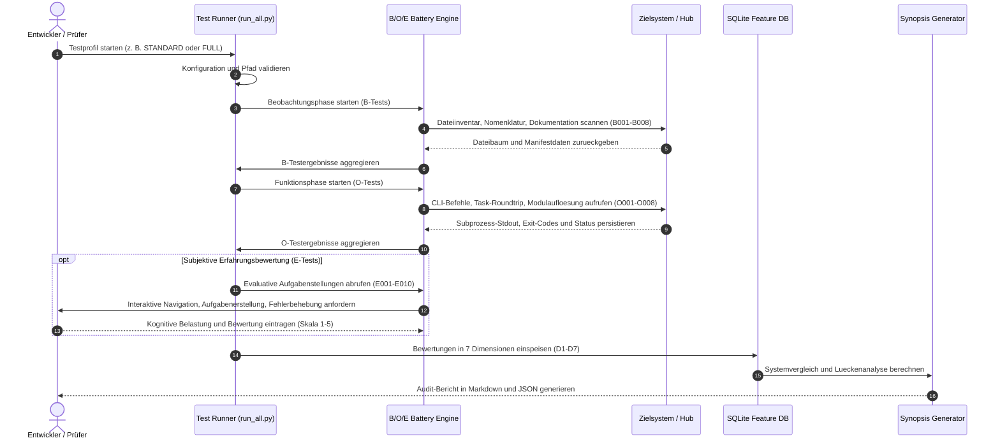

# ellmos-tests

> Strukturiertes B/O/E-Testframework für LLM-Betriebssysteme, Agent-Hubs und SKILL.md-Architekturen

[English](README.md) | [Deutsch](README_de.md)

[](https://python.org)
[](pyproject.toml)
[](LICENSE)
[](system_diff_tests/)
[](tests/)
[](llms.txt)
[](SECURITY.md)
[](THIRD_PARTY_LICENSES.md)
[](SECURITY.md)
[](https://github.com/ellmos-ai)
[](https://github.com/open-bricks)

---

## Schnellnavigation

| Index | Abschnitt | Beschreibung |
|---|---|---|
| 01 | [Übersicht & Kernphilosophie](#uebersicht) | Tri-modales B/O/E-Evaluierungsframework |
| 02 | [Ziel-Personas & Anwendungsfälle](#ziel-personas) | Hohe Relevanz für Architekten und Prüfer |
| 03 | [Vergleichsmatrix](#vergleichsmatrix) | 10 Dimensionen gegenüber 4 Industriealternativen |
| 04 | [Systemarchitektur-Topologie](#architektur) | 5-Ebenen-Topologiediagramm (Mermaid) |
| 05 | [Evaluierungslebenszyklus](#lebenszyklus) | Vollständiger Ausführungsablauf (Mermaid) |
| 06 | [B-Tests: Beobachtungsbatterie](#b-tests-beobachtung) | 8 automatisierte statische Prüfungen (B001–B008) |
| 07 | [O-Tests: Ausgabe- & Funktionsbatterie](#o-tests-ausgabe) | 8 funktionale Vertragstests (O001–O008) |
| 08 | [E-Tests: Erfahrungs- & UX-Batterie](#e-tests-erfahrung) | 10 qualitative Aufgaben für Nutzer & LLM (E001–E010) |
| 09 | [7 Bewertungsdimensionen](#bewertungsdimensionen) | Mehrdimensionale Bewertungsmethodik (D1–D7) |
| 10 | [Ausführungsprofile](#ausfuehrungsprofile) | Maßgeschneiderte Testprofile für diverse Szenarien |
| 11 | [Feature-Mapping-DB & Synopsis](#feature-mapping-db) | SQLite 50+ Dimensionen Feature-Vergleichs-Engine |
| 12 | [Anwendungsfall-Katalog](#anwendungsfall-katalog) | Maschinenlesbarer Katalog `usecases.json` |
| 13 | [Systemklassifikation](#systemklassifikation) | Kategorien SKILL, AGENT/HUB und TEXT-OS |
| 14 | [Schnellstart & CLI-Befehlsreferenz](#schnellstart) | Installation und Befehlsreferenz |
| 15 | [Projektstruktur & Modulaufbau](#projektstruktur) | Repository-Layout und kanonische Pfade |
| 16 | [Ökosystem-Integration](#oekosystem-integration) | Einbettung in BACH, ellmos-ai und open-bricks |
| 17 | [Sicherheit & 48h-SLA](#sicherheit-und-sla) | Rechtefreies RunAsInvoker und Sicherheits-SLA |
| 18 | [Gesetzlicher Hinweis & Haftung](#haftungsausschluss) | Gesetzlicher Hinweis gem. § 521 BGB & MIT-Lizenz |

---

<a id="uebersicht"></a><a id="overview"></a>
## 01. Übersicht & Kernphilosophie

**ellmos-tests** ist ein standardisiertes, lokales Test- und Benchmarking-Framework, das speziell für **LLM-Betriebssysteme**, **Agent-Hubs** und **SKILL.md-Architekturen** entwickelt wurde.

Die Evaluierung autonomer Agentenumgebungen bringt Herausforderungen mit sich, die herkömmliche Unit-Tests und einfache Prompt-Evaluationen nicht abdecken können:
- **Strukturelle Integrität**: Besitzt das Agentensystem valide Manifeste, standardisierte Skill-Schemata und konsistente Ordnerstrukturen?
- **Deterministische Ausgabe**: Funktionieren Werkzeugregistrierungen, Sitzungs-Checkpoints, Zustandspersistenz, Modulauffindbarkeit und Export-Routinen fehlerfrei?
- **Kognitive Nutzererfahrung**: Wie navigiert der Agent durch Arbeitsbereiche, wie reagiert er auf Syntaxfehler und wie bewältigt er Aufgabenkontexte ohne Desorientierung?

Zur Lösung dieses Problems führt `ellmos-tests` die **Tri-Modale B/O/E-Testmethodik** ein:

```
+-------------------------------------------------------------------------+
|                 TRI-MODALE B/O/E-EVALUIERUNGSMETHODIK                   |
+--------------------+---------------------+------------------------------+
| B-Tests            | O-Tests             | E-Tests                      |
| BEOBACHTUNG        | AUSGABE             | ERFAHRUNG                    |
| "Was existiert?"   | "Funktioniert es?"  | "Wie fühlt es sich an?"      |
| 8 Statische Audits | 8 Vertragstests     | 10 Qualitative UX-Aufgaben   |
| Automatisch & Schnell| Funktional & Strikt | Menschlicher oder LLM-Prüfer |
+--------------------+---------------------+------------------------------+
```

Maschinenlesbare Architekturanweisungen, Fähigkeiten und Navigationspfade sind in [`llms.txt`](llms.txt) indexiert.

---

<a id="ziel-personas"></a><a id="personas"></a>
## 02. Ziel-Personas & Anwendungsfälle

`ellmos-tests` richtet sich an vier zentrale Praxis-Personas:

- **`[PERSONA-01]` LLM-OS-Architekt & Systementwickler**
  *Ziel*: Validierung von Strukturinvarianten, Gedächtnispersistenz und Tool-Routing für komplexe Agenten-Frameworks (z. B. BACH, recludOS, Text-OS).
  *Werkzeuge*: B-Tests (B001–B008), Feature-Mapping-DB (`system_diff_tests/mapping/`), `config.py`.

- **`[PERSONA-02]` AI-Agent-Framework-Evaluator & Benchmarker**
  *Ziel*: Erzeugung objektiver Vergleichswerte über 7 kognitive Dimensionen (Onboarding, Navigation, Gedächtnis, Aufgaben, Kommunikation, Tools, Fehlerbehandlung).
  *Werkzeuge*: Synopsis-Generator, 7-Dimensionen-Bewertungsskala (D1–D7), Profile (`FULL`, `STANDARD`).

- **`[PERSONA-03]` Autonome Agenten-QA & CI/CD-Ingenieur**
  *Ziel*: Integration deterministischer Smoke-Tests und Regressionsbatterien in automatisierte GitHub Actions-Pipelines ohne externe API-Kosten oder Ratenbegrenzung.
  *Werkzeuge*: Battery-Runner (`tests/run_batteries.py`), `release_smoke`-Batterie, 23+ automatisierte Tests.

- **`[PERSONA-04]` Enterprise-LLM-Integrator & Compliance-Auditor**
  *Ziel*: Prüfung von Drittanbieter-Modulen auf Zero-Network-Egress, unprivilegierte lokale Ausführung (`RunAsInvoker`) und saubere Lizenzgrenzen.
  *Werkzeuge*: `THIRD_PARTY_LICENSES.md`, `O007_module_findability.py`, `O008_stack_composition.py`.

---

<a id="vergleichsmatrix"></a><a id="comparative-matrix"></a>
## 03. Vergleichsmatrix gegenüber Alternativen

Die folgende Tabelle stellt `ellmos-tests` gängigen Evaluierungs- und Testwerkzeugen gegenüber, zugeordnet zu unseren Governance-Invarianten (`INV-LOCAL-01` bis `INV-SLA-10`):

| Evaluierungsdimension | Invariante | ellmos-tests | Promptfoo | DeepEval / Ragas | Inspect AI | Manuell / Skripte |
|---|---|---|---|---|---|---|
| **Tri-Modale B/O/E-Architektur** | `INV-LOCAL-01` | **Vollständig (B+O+E)**| Nur Output | Nur Metrik-Output | Nur Task-Output | Unstandardisiert |
| **Natives SKILL.md & LLM-OS-Binding**| `INV-LOCAL-02`| **Nativ First-Class** | Keine (Prompts) | Keine (RAG/LLM) | Partiell (Agents) | Ad-hoc |
| **Zero-Egress Lokale Ausführung** | `INV-LOCAL-03` | **100% Offline** | Benötigt LLM-API | Benötigt LLM-API | Benötigt LLM-API | Variabel |
| **SQLite Feature-DB & Gap-Analyse**| `INV-LOCAL-04`| **Integriert (50+ Dims)**| Keine | Keine | Benchmark-Suiten| Keine |
| **Kuratierte Batterien & Profile** | `INV-LOCAL-05` | **Profile integriert** | Testmatrizen | Testfälle | Python-Tasks | Manuelle Textdateien |
| **Modulfindbarkeit & Stack-Aufbau** | `INV-LOCAL-06` | **Integriert (O007/8)**| Keine | Keine | Keine | Keine |
| **Standard-Library First (0 C-Ext)**| `INV-LOCAL-07` | **100% Stdlib-Kern** | Node.js-Ökosystem| PyTorch / Schwer | Python-Ökosystem| Minimal |
| **Rechtefreier RunAsInvoker-Modus** | `INV-LOCAL-08` | **Garantiert** | User-Space | User-Space | User-Space | Unbekannt |
| **Multi-Device Sync & Lock-Schutz** | `INV-LOCAL-09` | **Fail-Closed sicher**| N/A | N/A | N/A | Konfliktanfällig |
| **Formelles Sicherheits-SLA (48h)** | `INV-SLA-10` | **48h / 5 Tage Triage**| Best Effort | Best Effort | Community | Keine |

---

<a id="architektur"></a><a id="architecture"></a>
## 04. Systemarchitektur-Topologie

Das Diagramm veranschaulicht die 5-Ebenen-Architektur von `ellmos-tests`:

```mermaid
flowchart TD
    subgraph Target["Zu testende Zielsysteme"]
        T1["SKILL.md Fähigkeiten<br/>(Einzelne Skill-Module)"]
        T2["Agent Hubs<br/>(Tool-Registries & Workflows)"]
        T3["Vollständige LLM-Betriebssysteme<br/>(BACH, recludOS, Text-OS)"]
    end

    subgraph Framework["ellmos-tests Kernframework"]
        CF1["Konfigurations- & Pfadauflöser<br/>(config.py)"]
        CF2["Battery-Runner & Profil-Engine<br/>(run_batteries.py / test_runner.py)"]
        CF3["Test-Dispatcher<br/>(run_all.py / run_external.py)"]
    end

    subgraph Battery["B / O / E Tri-Modale Testbatterie"]
        B1["B-Tests (Beobachtung)<br/>Statische Prüfung: B001–B008"]
        B2["O-Tests (Ausgabe)<br/>Funktionale Verträge: O001–O008"]
        B3["E-Tests (Erfahrung)<br/>Evaluative Aufgaben: E001–E010"]
    end

    subgraph Analytics["Evaluierungs- & Analyse-Engine"]
        A1["SQLite Feature-Mapping-DB<br/>(50+ Dimensionen, schema.sql)"]
        A2["Synopsis-Generator<br/>(Systemübergreifender Vergleich)"]
        A3["7-Dimensionen-Qualitätsscore<br/>(D1 Onboarding .. D7 Fehlerbehandlung)"]
    end

    subgraph Outputs["Prüfberichte & Artefakte"]
        O1["JSON- / Markdown-Berichte<br/>(Git-ignorierte Testergebnisse)"]
        O2["Use-Case-Abdeckungsmatrix<br/>(usecases.json Synchronisation)"]
        O3["CI / CD Status-Badges<br/>(Automatisches Regressions-Gate)"]
    end

    Target --> Framework
    Framework --> Battery
    Battery --> Analytics
    Analytics --> Outputs
```



---

<a id="lebenszyklus"></a><a id="lifecycle"></a>
## 05. Evaluierungslebenszyklus & Ablauf

Das Sequenzdiagramm stellt die End-to-End-Ausführung einer Evaluierung dar:



---

<a id="b-tests-beobachtung"></a><a id="b-tests"></a>
## 06. B-Tests: Beobachtungsbatterie (B001–B008)

B-Tests führen eine statische, automatisierte externe Beobachtung des Zielsystems durch, ohne fremden Code auszuführen:

| Test-ID | Name | Fokus | Prüfkriterium |
|---|---|---|---|
| **B001** | `file_inventory` | Dateipräsenz & Inventar | Erfasst Dateien, kategorisiert Erweiterungen, markiert fehlende Pflichtdateien. |
| **B002** | `format_consistency` | Formate & Kodierung | Prüft UTF-8-Konformität, Zeilenumbrüche (LF/CRLF), Markdown-Syntax. |
| **B003** | `directory_depth` | Strukturtiefe | Analysiert Ordnerhierarchien und warnt vor übermäßig verschachtelten Pfaden. |
| **B004** | `naming_analysis` | Namenskonventionen | Überprüft einheitliche snake_case- oder kebab-case-Nomenklatur. |
| **B005** | `documentation_check`| Dokumentationsabdeckung| Bestätigt Existenz von README, SKILL.md, AGENTS.md und Lizenzen. |
| **B006** | `code_metrics` | Codemetriken & Dichte | Ermittelt Codezeilen (LOC), Kommentardichte und Funktionslängen. |
| **B007** | `dependency_scan` | Abhängigkeitsprüfung | Prüft externe Anforderungen, venv-Isolation und Lizenzkompatibilität. |
| **B008** | `age_analysis` | Zeitstempelanalyse | Durchsucht Änderungsdaten nach veralteten Artefakten und verwaisten Modulen. |

---

<a id="o-tests-ausgabe"></a><a id="o-tests"></a>
## 07. O-Tests: Ausgabe- & Funktionsbatterie (O001–O008)

O-Tests überprüfen die funktionale Korrektheit von Eingabe zu Ausgabe über isolierte CLI-Subprozesse:

| Test-ID | Name | Fokus | Funktionale Prüfung |
|---|---|---|---|
| **O001** | `task_roundtrip` | Aufgabenlebenszyklus | Erstellt, aktualisiert, listet und beendet eine Aufgabe via CLI. |
| **O002** | `memory_persistence` | Persistenzprüfung | Speichert Eintrag, beendet Sitzung, startet neu und prüft Abruf. |
| **O003** | `tool_registry` | Werkzeugregistrierung | Prüft Tool-Erkennung, Parameterschemavalidierung und Ausführung. |
| **O004** | `backup_restore` | Backup & Recovery | Testet Systemzustands-Snapshots und atomare Wiederherstellung. |
| **O005** | `config_validation` | Konfigurationsparsing | Injiziert ungültige Konfigurationen und prüft Fehlermeldungen. |
| **O006** | `export_import` | Datenaustausch | Validiert portablen JSON/YAML-Export und Re-Import-Integrität. |
| **O007** | `module_findability`| Modulkatalog-Vertrag | Prüft Modulregister, Fähigkeitssignaturen und CLI `resolve <id>`. |
| **O008** | `stack_composition` | Stack-Manifest-Vertrag | Prüft Stack-Rezepte, Querverlinkungen und CLI `resolve <manifest>`. |

---

<a id="e-tests-erfahrung"></a><a id="e-tests"></a>
## 08. E-Tests: Erfahrungs- & UX-Batterie (E001–E010)

E-Tests evaluieren die qualitative kognitive Ergonomie und die Nutzbarkeit des Agenten-Workflows:

| Test-ID | Name | Evaluativer Schwerpunkt |
|---|---|---|
| **E001** | `skill_readability` | Verständlichkeit, Prägnanz und kognitiver Aufwand von `SKILL.md`. |
| **E002** | `navigation_ease` | Wie intuitiv ein Agent relevante Befehle und Pfade lokalisiert. |
| **E003** | `task_creation` | Reibungsarmut und Ergonomie beim Definieren neuer Aufgaben. |
| **E004** | `task_finding` | Treffsicherheit beim Filtern und Abfragen vorhandener Aufgabenstände. |
| **E005** | `memory_write` | Ergonomie beim Hinterlegen strukturierter und unstrukturierter Notizen. |
| **E006** | `memory_read` | Präzision beim semantischen oder stichwortbasierten Gedächtnisabruf. |
| **E007** | `tool_usage` | Fehlerhäufigkeit und Parameterreibung beim Aufrufen registrierter Tools. |
| **E008** | `error_recovery` | Resilienz bei fehlerhaften Skripten, fehlenden Dateien oder Fehleingaben. |
| **E009** | `session_startup` | Onboarding-Geschwindigkeit beim Start einer neuen Agentensitzung. |
| **E010** | `overall_impression`| Ganzheitliche subjektive Bewertung von Systemrobustheit und Ergonomie. |

---

<a id="bewertungsdimensionen"></a><a id="dimensions"></a>
## 09. 7 Bewertungsdimensionen & Notenskala

Die Ergebnisse werden über sieben Kerndimensionen auf einer Skala von 1,0 bis 5,0 synthetisiert:

| Dimension | Fragestellung | Zielzustand |
|---|---|---|
| **D1 Onboarding** | *Wie schnell kann ein neuer Agent produktiv arbeiten?* | Vollständig innerhalb von 1 Prompt; keine fehlenden Abhängigkeiten. |
| **D2 Navigation** | *Wie verlässlich findet der Agent Werkzeuge und Pfade?* | Vorhersehbare Pfade; strukturierte Ordner; konsistenter Index. |
| **D3 Gedächtnis** | *Wie dauerhaft und abfragbar ist der Sitzungszustand?* | Übersteht Neustarts; null Datenverlust; schneller Abruf. |
| **D4 Aufgaben** | *Wie robust ist das Task-Tracking und der Dispatch?* | Atomare Aktualisierungen; Idempotenz; klare Statusstände. |
| **D5 Kommunikation**| *Wie verständlich ist die Ausgabe- und Dialogführung?*| Sauberes Markdown; strukturierte Tabellen; klare Fehlerhinweise. |
| **D6 Werkzeuge** | *Wie nutzbar und zuverlässig sind die Tool-Schnittstellen?*| Valide Schemata; deterministische Exit-Codes; keine Abstürze. |
| **D7 Fehlertoleranz**| *Wie resilient reagiert das System auf Störungen?* | Fail-Closed; hilfreiche Vorschläge; Erhalt des Systemzustands. |

```
1.0: Sehr mangelhaft / Nicht vorhanden  ·  2.0: Mangelhaft  ·  3.0: Akzeptabel  ·  4.0: Gut  ·  5.0: Exzellent
```

---

<a id="ausfuehrungsprofile"></a><a id="profiles"></a>
## 10. Ausführungsprofile

`ellmos-tests` stellt vordefinierte Profile für unterschiedliche Zeitbudgets und Testziele bereit:

| Profil | Zeitrahmen | Enthaltene Tests | Primärer Einsatzzweck |
|---|---|---|---|
| **QUICK** | ~10 min | E001, E002, E010 | Schnelle Ersteinschätzung und Triage |
| **STANDARD** | ~25 min | 9 E-Tests (ohne E008) | Ausgewogene operative Evaluierung |
| **FULL** | ~40 min | Alle 10 E-Tests + B + O | Umfassendes Gesamtaudit |
| **MEMORY_FOCUS** | ~15 min | E005, E006, E010 | Vergleich von Speicher- und Persistenzarchitekturen |
| **TASK_FOCUS** | ~15 min | E003, E004, E010 | Benchmarking von Aufgabenverwaltungsworkflows |
| **OBSERVATION** | ~20 min | B001–B008 | 100% automatisierte statische Analyse (CI-fähig) |
| **OUTPUT** | ~35 min | O001–O008 | 100% automatisierte Funktionsvertragsprüfung |
| **MODULE_STACK_FOCUS**| ~5 min | O007, O008 | Fokussierte Prüfung für Modulkataloge und Stack-Rezepte |

---

<a id="feature-mapping-db"></a><a id="feature-db"></a>
## 11. Feature-Mapping-DB & Synopsis-Generator

Das Framework verfügt über eine integrierte SQLite-Datenbank (`system_diff_tests/mapping/`) mit **über 50 standardisierten Fähigkeitsdimensionen**:

- **Alias-Auflösung**: Vereinheitlicht systemspezifische Bezeichnungen (z. B. `tasks` vs. `todos` vs. `actions`).
- **Lückenanalyse**: Erkennt automatisch fehlende Funktionen im Vergleich konkurrierender Systeme.
- **Synopsis-Generator**: Vergleicht Systeme und generiert Markdown-Tabellen und JSON-Matrizen.

```bash
# Feature-Datenbank abfragen
python system_diff_tests/mapping/query_db.py --list-features
python system_diff_tests/mapping/query_db.py --system BACH_v2_vanilla
```

---

<a id="anwendungsfall-katalog"></a><a id="usecases"></a>
## 12. Anwendungsfall-Katalog (`usecases.json`)

Das Repository enthält einen maschinenlesbaren Katalog von **50 nutzerorientierten Anwendungsfällen** (`usecases.json`):
- Verfolgt den Abdeckungsstatus (`COVERED`, `PARTIAL`, `OPEN`) modularer Fähigkeiten.
- Wird über `tools/usecases_sync.py` direkt mit Systemdatenbanken synchronisiert.
- Ermöglicht eine kontinuierliche Abdeckungsprüfung bei der Einführung neuer Module.

---

<a id="systemklassifikation"></a><a id="classification"></a>
## 13. Systemklassifikation

Vor der Durchführung von Tests wird das Zielsystem klassifiziert, um die passende Auswertung anzuwenden:

| Systemklasse | Definition | Testfokus |
|---|---|---|
| **SKILL** | Einzelfähigkeit in einer isolierten `SKILL.md` | Verständlichkeit der Anweisungen, Argumente, Schemakorrektheit |
| **AGENT / HUB** | Modulsammlung mit zentraler Steuerungslogik | Tool-Registrierung, Navigationsindex, Workflow-Ergonomie |
| **TEXT-OS** | Ganzheitliches LLM-Betriebssystem (BACH, recludOS) | Gesamter Lebenszyklus, Zustandspersistenz, Session-Recovery |

---

<a id="schnellstart"></a><a id="quickstart"></a>
## 14. Schnellstart & CLI-Befehlsreferenz

### Installation

```bash
# Repository klonen
git clone https://github.com/ellmos-ai/ellmos-tests.git
cd ellmos-tests

# Keine schweren externen Pakete erforderlich! Kern läuft auf Python 3.10+ Standard Library
```

### Ausführen von Tests

```bash
# 1. Automatisierte statische Beobachtungstests ausführen (B-Tests)
python system_diff_tests/run_all.py "/pfad/zum/zielsystem" --only b

# 2. Automatisierte funktionale Vertragstests ausführen (O-Tests)
python system_diff_tests/run_all.py "/pfad/zum/zielsystem" --only o

# 3. Vollständige automatisierte B- und O-Batterie ausführen
python system_diff_tests/run_all.py "/pfad/zum/zielsystem"

# 4. Vorkonfigurierten System-Alias verwenden
python system_diff_tests/run_all.py --system recludOS

# 5. Vordefinierte Checklisten-Batterien auflisten und starten
python tests/run_batteries.py --list
python tests/run_batteries.py --battery release_smoke --system-path "/pfad/zum/zielsystem"

# 6. Interne Regressionssuite des Repositories ausführen (23+ Unittests)
python -m unittest discover -s tests -p "test_*.py"
pytest
```

---

<a id="projektstruktur"></a><a id="structure"></a>
## 15. Projektstruktur & Modulaufbau

```
ellmos-tests/
├── SKILL.md                         # LLM-orientierte Modulanweisungen & Grenzen
├── AGENTS.md                        # Agenten-Einstiegshinweise
├── ellmos-module.v2.json            # Kanonisches Modulmanifest (Schema v2)
├── ellmos-module.json               # Veraltetes v1-Manifest (Kompatibilitätsleser)
├── pyproject.toml                   # PEP 621 Paket-Metadaten & Pytest-Konfiguration
├── pytest.ini                       # Pytest Testpfade & Optionen
├── llms.txt                         # LLM-Kontext & Architekturindex
├── LICENSE                          # MIT-Lizenz
├── THIRD_PARTY_LICENSES.md          # SBOM, RunAsInvoker-Garantie & 10 Invarianten
├── SECURITY.md                      # Sicherheitsrichtlinie & 48h-SLA
├── MARKETING-LOG.txt                # Repository-lokales Audit- & Discoverability-Log
├── usecases.json                    # 50 maschinenlesbare Anwendungsfälle
├── system_diff_tests/
│   ├── config.py                    # Zentrale Pfadkonfiguration und Systemauflösung
│   ├── run_all.py                   # Haupt-Runner für B- und O-Testbatterien
│   ├── testing_workflow.md          # Umfassende B/O/E-Methodik-Dokumentation
│   ├── comparation_workflow.md      # Methodik für systemübergreifende Vergleiche
│   ├── feature_mapping_workflow.md  # Dokumentation zur Feature-Mapping-Datenbank
│   ├── testing/
│   │   ├── run_external.py          # Kompatibilitätsrunner mit Profil-Engine
│   │   ├── b_tests/                 # B001–B008 Beobachtungstest-Implementierungen
│   │   ├── o_tests/                 # O001–O008 Funktionstest-Implementierungen
│   │   ├── e_tests/                 # E001–E010 Qualitative UX-Aufgaben
│   │   ├── profiles/                # Vordefinierte Ausführungsprofile
│   │   └── t_profiles/              # Modulare Stack-Profile (MODULE_STACK_FOCUS)
│   └── mapping/
│       ├── schema.sql               # SQLite Feature-Mapping-Schema (50+ Dimensionen)
│       ├── populate_db.py           # Skript zur Initialisierung der Feature-DB
│       └── query_db.py              # Abfragewerkzeug und Diff-Generator
├── tests/
│   ├── test_metadata.py             # Vertragstests (PEP 621, URLs, Anker, Diagramme)
│   ├── test_config_paths.py         # Pfadauflösungs-Regressionsprüfungen
│   ├── test_module_surfaces.py      # Manifest- und Profilpräsenztests
│   ├── test_public_readiness.py     # PII- und Datenschutz-Gate-Tests
│   ├── test_run_batteries.py        # Battery-Parser-Regressionsprüfungen
│   ├── test_module_stack_focus.py   # O007/O008 Wiring- und Register-Vertragstests
│   └── batteries/                   # Vordefinierte Checklisten-Batterien (.txt)
└── assets/
    ├── banner.png                   # Hochauflösendes Banner
    └── banner.svg                   # Vektor-SVG-Banner
```

---

<a id="oekosystem-integration"></a><a id="ecosystem"></a>
## 16. Ökosystem-Integration

`ellmos-tests` wurde ursprünglich aus dem portablen Testkern von **BACH** (`system/tools/testing`) extrahiert und bildet heute die standardisierte Referenz für die B/O/E-Qualitätsprüfung in der Organisation **ellmos-ai** und dem Dach **open-bricks**:

- **BACH-Integration**: BACH nutzt `ellmos-tests` über einen Adapter, wodurch die Testlogik sauber von hostspezifischen Dämonen getrennt bleibt.
- **Modulbaukasten-Kompatibilität**: Prüft Auffindbarkeit (`O007`) und Zusammensetzung (`O008`) modularer Systeme unter `.TOPICS/.AI/.MODULES`.
- **Ökosystem-Verbund**: Ergänzt weitere ellmos-Module wie `session-checkpoint`, `condition-gates`, `mail-connector` und `claude-bridge`.

---

<a id="sicherheit-und-sla"></a><a id="security"></a>
## 17. Sicherheit & 48h-SLA

`ellmos-tests` basiert auf defensiver, lokaler Isolation:

- **Rechtefreier Modus (`RunAsInvoker`)**: Läuft strikt im unprivilegierten Benutzerkontext ohne Administrator- oder Root-Rechte.
- **Zero-Egress Datenschutz**: Das Test-Harness arbeitet 100% offline ohne Telemetrie, Analyseübertragungen oder Remote-Abfragen.
- **48h Sicherheits-SLA**: Über GitHub Private Vulnerability Reporting eingereichte Sicherheitsmeldungen erhalten innerhalb von **48 Stunden** eine qualifizierte Erstantwort mit einer 5-Tage-Triage-Garantie.
- **Erhalt der Invarianten**: Garantiert die Einhaltung aller zehn Governance-Invarianten `INV-LOCAL-01` bis `INV-SLA-10`.

---

<a id="haftungsausschluss"></a><a id="liability"></a>
## 18. Gesetzlicher Hinweis & Haftungsausschluss

### Haftungsausschluss gem. § 521 BGB (Gefälligkeitsrecht / Schenkung)

Dieses Open-Source-Software-Projekt wird **unentgeltlich als Schenkung** zur Verfügung gestellt. Die Haftung des Autors und der Mitwirkenden ist gemäß **§ 521 BGB** auf **Vorsatz und grobe Fahrlässigkeit** beschränkt. Eine Sach- und Rechtsmängelhaftung ist nach Maßgabe der §§ 523, 524 BGB im gesetzlich zulässigen Rahmen ausgeschlossen. Die Nutzung erfolgt auf eigenes Risiko.

### Lizenz

Veröffentlicht unter den Bedingungen der **MIT-Lizenz**. Der vollständige Lizenztext befindet sich in [LICENSE](LICENSE).
Copyright © 2026 Lukas Geiger.
