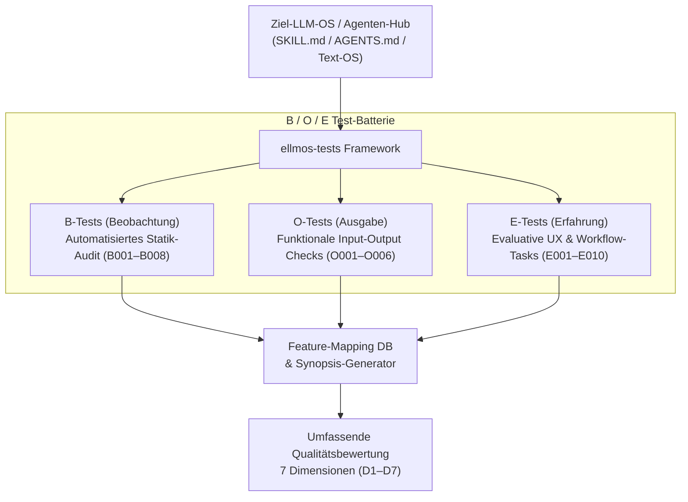

# ellmos-tests

> Strukturiertes B/O/E-Test-Framework für LLM-Betriebssysteme und Agenten-Hubs

[English](README.md) | [Deutsch](README_de.md)

[](https://python.org)
[](LICENSE)
[](system_diff_tests/)
[](tests/)
[](llms.txt)
[](https://github.com/ellmos-ai/ellmos-tests/actions/workflows/tests.yml)

**Direktlinks:** [Testphilosophie](#testphilosophie-b--o--e) · [Schnellstart](#schnellstart) · [Funktionen](#funktionen) · [Mitwirken](CONTRIBUTING.md)

---

## Was ist das?

**ellmos-tests** evaluiert und vergleicht `SKILL.md`-basierte Systeme (LLM-Betriebssysteme) anhand von drei komplementären Testperspektiven. Es bietet eine strukturierte Methodik, um die Leistungsfähigkeit eines LLM-OS in den Bereichen Onboarding, Navigation, Gedächtnis, Aufgabenverwaltung, Werkzeuge, Kommunikation und Fehlertoleranz zu bewerten.

Es ist als LLM-bindbares ellmos-Modul paketiert: `SKILL.md` weist einen Agenten an, wie das Testkit bedient wird, und `ellmos-module.v2.json` (kanonisches Manifest) deklariert Kategorie, Fähigkeiten, Oberflächen und Grenzen.

> [!NOTE]
> **LLM / KI-Agenten Kontext**: Maschinenlesbare Architektur, Suchphrasen und Modul-Richtlinien sind in [`llms.txt`](llms.txt) indiziert.

---

## Architektur & Test-Pipeline



---

## Testphilosophie: B / O / E

| Perspektive | Typ | Fragestellung | Tests |
|-------------|-----|---------------|-------|
| **B-Tests** (Beobachtung) | Automatisiert, extern | *"Was existiert?"* | 8 Tests (B001–B008) |
| **O-Tests** (Ausgabe) | Funktional, Input→Output | *"Funktioniert es?"* | 6 Tests (O001–O006) |
| **E-Tests** (Erfahrung) | Subjektiv, prozessorientiert | *"Wie fühlt es sich an?"* | 10 Aufgaben (E001–E010) |

**Testdefinitionen vs. automatisierte Suite.** Die 24 B/O/E-Einträge sind *Testdefinitionen*, die dieses Kit gegen ein Zielsystem ausführt — die 10 E-Aufgaben davon sind Prompts für Mensch oder LLM, kein Code. Die Regressionssuite des Repos selbst sind die 15 unittest-Tests unter `tests/` (`python -m unittest discover -s tests`).

| B-Tests — BEOBACHTUNG | O-Tests — AUSGABE | E-Tests — ERFAHRUNG |
|-----------------------|-------------------|---------------------|
| Inventar | Validierung | Workflow |
| Struktur | Korrektheit | Orientierung |
| Konsistenz | Vollständigkeit | Kognitive Last |
| Metriken | Robustheit | Handlungsspielraum |

---

## Funktionen

- **8 B-Tests** — Dateiinventar, Formatkonsistenz, Verzeichnistiefe, Benennungsanalyse, Dokumentationsprüfung, Code-Metriken, Abhängigkeitsscan, Altersanalyse
- **6 O-Tests** — Task-Roundtrip, Speicher-Persistenz, Tool-Register, Backup/Restore, Konfigurationsvalidierung, Export/Import
- **10 E-Tests** — SKILL.md-Lesbarkeit, Navigation, Erstellung von Aufgaben, Auffinden von Aufgaben, Schreiben/Lesen des Speichers, Tool-Nutzung, Fehler-Wiederherstellung, Sitzungsstart, Gesamteindruck
- **Feature-Mapping-DB** — SQLite-Datenbank mit 50+ Features, mehrdimensionalen Bewertungen, Alias-Auflösung, Lückenanalyse und Duplikaterkennung
- **Synopsis-Generator** — Automatisierte systemübergreifende Vergleiche mit JSON- und Markdown-Ausgabe
- **Use-Case-Katalog** — `usecases.json`: maschinenlesbarer Katalog von 50 anwenderorientierten BACH-Anwendungsfällen mit `covering_skill` und `coverage_status` (COVERED/PARTIAL/OPEN)
- **Test-Batterien** — Vordefinierte Testsammlungen (Smoke-Tests, UX-Tests, Integrationstests usw.)
- **Systemklassifikation** — SKILL / AGENT / TEXT-OS mit klassenspezifischer Testgewichtung

---

## Schnellstart

```bash
# Repository klonen
git clone https://github.com/ellmos-ai/ellmos-tests.git
cd ellmos-tests

# B-Tests gegen ein System ausführen
python system_diff_tests/run_all.py "/pfad/zum/llm-os" --only b

# O-Tests gegen ein System ausführen
python system_diff_tests/run_all.py "/pfad/zum/llm-os" --only o

# Alle automatisierten Tests ausführen
python system_diff_tests/run_all.py "/pfad/zum/llm-os"

# Bekanntes System verwenden (konfiguriert in config.py)
python system_diff_tests/run_all.py --system recludOS

# Verfügbare Testbatterien anzeigen
python tests/run_batteries.py --list

# Lokale Smoketests ausführen
python -m unittest discover -s tests -p "test_*.py"
```

---

## 7 Bewertungsdimensionen

| Dimension | Fragestellung |
|-----------|---------------|
| **D1 Onboarding** | Wie schnell kann man starten? |
| **D2 Navigation** | Wie gut findet man sich zurecht? |
| **D3 Gedächtnis** | Wie gut funktioniert Persistenz? |
| **D4 Aufgaben** | Wie gut ist die Aufgabenverwaltung? |
| **D5 Kommunikation** | Wie gut ist die Nutzerinteraktion? |
| **D6 Werkzeuge** | Wie nutzbar sind die Tools? |
| **D7 Fehlertoleranz** | Wie robust ist die Fehlerbehandlung? |

---

## Haftung / Liability

Dieses Projekt ist eine **unentgeltliche Open-Source-Schenkung** im Sinne der §§ 516 ff. BGB. Die Haftung des Urhebers ist gemäß **§ 521 BGB** auf **Vorsatz und grobe Fahrlässigkeit** beschränkt. Ergänzend gelten die Haftungsausschlüsse aus der MIT-Lizenz.

Nutzung auf eigenes Risiko. Keine Wartungszusage, keine Verfügbarkeitsgarantie, keine Gewähr für Fehlerfreiheit oder Eignung für einen bestimmten Zweck.

This project is an unpaid open-source donation. Liability is limited to intent and gross negligence (§ 521 German Civil Code). Use at your own risk.
